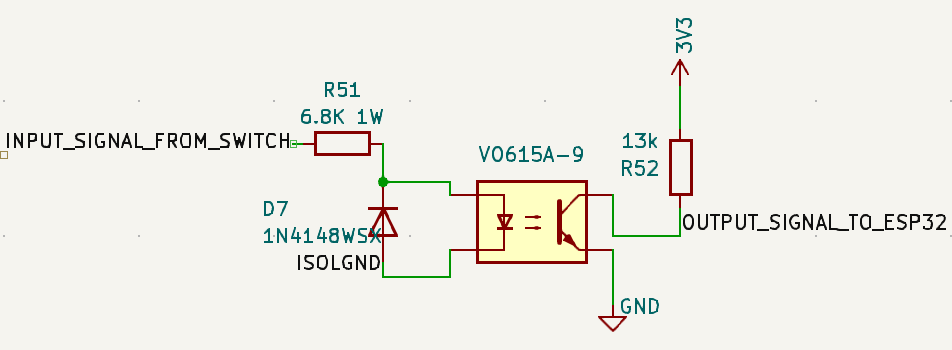

# Digital Inputs

The system supports two distinct digital input architectures:

1. **Optocoupler Style**: Activated by voltage input (5-54V) 
2. **Ground Style**: Activated by shorting input to ground 

---

# Optocoupler Style Digital Inputs



## Design Requirements
- **Input voltage range**: 5V to 54V on any of 6 digital input channels that use optical isolators
- **Temperature range**: -40°F to 180°F (-40°C to 82°C)
- **Lifetime target**: 10+ years at typical voltages (~12V), 3-6 years at maximum voltage (54V)

## How an Optocoupler Works

The VO615A optocoupler provides electrical isolation between input circuit and ESP32 GPIO using light transmission:

### Input Side (LED)
1. Input voltage applied across current limiting resistor and IR LED
2. Forward current flows through LED, producing infrared light
3. Light intensity proportional to forward current

### Output (ESP32 GPIO) Side (Phototransistor)
1. IR light strikes phototransistor base region
2. Light creates electron-hole pairs, acting as base current
3. Transistor turns on, allowing collector current to flow
4. Collector current = LED current × CTR (Current Transfer Ratio)
5. When sufficient collector current flows, voltage at collector drops low enough to register as logic LOW on ESP32
6. Voltage otherwise pulled high (3.3V) by pull up resistor to 3.3V Supply

### Isolation Benefits
- **Protection**: High voltage transients on input side cannot damage ESP32
- **Flexibility**: Can accept input signals from 5V to 60V (lower life at higher voltages)

## Component Selection

### Optocoupler: VO615A-9
- **CTR**: 200-400% minimum (vs 50-600% for base VO615A)
- **Reason**: Higher CTR enables reliable switching at low input voltages (5V), minimal extra cost

### Current Limiting Resistor: 6.8kΩ, 1W, 2512 SMD
- **Calculation basis**:
  - At 5V: IF = (5V - 1.43V) / 6.8kΩ = 0.53 mA
  - At 54V: IF = (54V - 1.43V) / 6.8kΩ = 7.7 mA
- **Power rating**: 404mW at 54V requires 1W resistor for safety margin

### Pull-up Resistor: 13kΩ, 0603 SMD
- **Logic HIGH**: When LED is OFF, phototransistor is OFF, collector pulled to 3.3V through 13kΩ
- **Logic LOW**: When LED is ON, phototransistor conducts, pulling collector toward ground
- **Switching threshold**: ESP32 typically switches at ~1.65V (50% of 3.3V)

## Performance Analysis

| Input Voltage | LED Current | vs Min (1mA) | Lifetime | Power (Watts) | Power (mA@12V) |
|---------------|-------------|--------------|----------|---------------|----------------|
| 5V | 0.53 mA | 53% of min | 20+ years | 1.9 mW | 0.16 mA |
| 12V | 1.57 mA | 157% of min | 20+ years | 17 mW | 1.4 mA |
| 28V | 3.91 mA | 391% of min | 10+ years | 104 mW | 8.7 mA |
| 54V | 7.7 mA | 770% of min | 3-6 years | 404 mW | 33.7 mA |

**Power consumption notes**:
- Power is consumed **only when Input Signal is active** (ie external switch is ON)
- **No power consumption when Input Signal = 0V** (ie external switch OFF)
- LED power = Forward current × 1.43V (LED forward voltage)
- Resistor power = Forward current² × 6.8kΩ

## Protection Diode: 1N4148WSX

### Function: Reverse Voltage Protection
The 1N4148WSX diode provides critical protection for the optocoupler LED:

- **Normal operation**: Diode is reverse biased across LED, no current flows
- **Reverse voltage protection**: If Input Signal goes negative, diode conducts and clamps reverse voltage to ~0.7V
- **Prevents LED damage**: VO615A LED can only handle 6V reverse voltage maximum

### Why Critical 
- **Load dump transients**: Long wires / disconnection can create voltage spikes
- **Electrical noise**: Marine electrical systems are electrically noisy environments

### Specifications & Failure Limits
- **Forward voltage**: 0.7V typical, 1.25V maximum at 10mA
- **Reverse voltage rating**: 75V maximum
- **Forward current rating**: 300mA continuous, 2A peak (1µs pulse)
- **Power dissipation**: 350mW at 25°C

### Failure Analysis
**The diode will fail if:**
- **Forward current > 300mA continuous**: At maximum negative transient
- **Reverse voltage > 75V**: If positive Input Signal exceeds 75V (well above our 54-60V max)
- **Power dissipation > 350mW**: P = If × 0.7V, so fails at If > 500mA

The 1N4148WSX provides robust protection for all expected marine transient conditions.

## System Power Consumption

| Condition | LED Side | ESP32 Side | Total Power | Total (mA@12V) |
|-----------|----------|-------------|-------------|----------------|
| **Input OFF** | 0 mW | 0.83 mW | 0.83 mW | 0.07 mA |
| **Input ON (12V)** | 17 mW | ~0 mW | 17 mW | 1.4 mA |
| **Input ON (54V)** | 404 mW | ~0 mW | 404 mW | 33.7 mA |

## LED Current Guidelines
- **1-3mA**: Conservative operation (20+ year lifetime)
- **3-8mA**: Moderate operation (5-10 year lifetime)  
- **8-15mA**: Aggressive operation (1-5 year lifetime)

## Design Validation
- **5V switching**: 0.53mA with 200% CTR provides reliable switching despite being below 1mA datasheet specification
- **54V survival**: 7.7mA current provides marginal 3-6 year life if 100% duty cycle
- **Temperature performance**: VO615A-9's high CTR provides margin for temperature derating across -40°F to 180°F range

## Schematic Implementation
```
Input Signal ──[6.8kΩ, 1W]──[LED|──── GND
                                 |
                                 |  (Optical coupling)
                                 |
ESP32_GPIO ──[13kΩ]──3.3V        |
        └─────────────[Collector|Emitter]──── GND
```

## Bill of Materials (Optocoupler Style)
- **U1**: VO615A-9 optocoupler
- **R1**: 6.8kΩ ±1%, 1W, 2512 SMD resistor  
- **R2**: 13kΩ ±5%, 1/8W, 0603 SMD pull-up resistor
- **D1**: 1N4148WSX fast switching diode, SOD-323 SMD

---

# Ground Style Digital Inputs

## Schematic
```
                         R57
3.3V ──[10kΩ]──┬──[C51:1µF]──GND
               │
               ├──[D32:ESD]──GND
               │
               ├── Output Signal to ESP32 GPIO
               │
               └──[R5:500Ω]── Input Signal
```

## Design Requirements
- **Input method**: Short to ground activation
- **Temperature range**: -40°F to 180°F (-40°C to 82°C)
- **Debouncing**: Hardware RC filter for switch bounce elimination
- **Protection**: ESD protection and current limiting for exposed inputs

## How Ground Style Inputs Work

This design uses a voltage divider with current limiting and RC debounce filtering:

### Normal Operation (Switch Open)
1. Input Signal is not connected (floating or open)
2. No current flows through R5 (500Ω)
3. Pull-up resistor R57 (10kΩ) pulls Output Signal to 3.3V
4. ESP32 GPIO reads logic HIGH (3.3V)

### Activated Operation (Switch Closed to Ground)
1. Input Signal is shorted to ground by external switch/contact
2. Current flows from 3.3V through R57 (13kΩ) to ground via the switch
3. Junction voltage: V_out = **0V** (direct connection to ground)
4. ESP32 GPIO reads logic LOW (0V << 0.8V threshold)

## Component Analysis

### Pull-up Resistor: R57 (13kΩ)
- **Function**: Pulls Output Signal HIGH when Input Signal is not grounded
- **Power when input open**: P = 3.3V²/13kΩ = 0.84 mW
- **Power when input grounded**: P = 3.3V²/13kΩ = 0.84 mW (continuous)

### Debounce Capacitor: C51 (1µF)
- **Function**: Filters switch bounce and electrical noise
- **Time constant**: τ = R57 × C51 = 10kΩ × 1µF = 10ms
- **Settling time**: ~3τ = 30ms for clean switching
- **Noise immunity**: Filters high-frequency electrical noise

### ESD Protection Diode: D32 (ESD5Z25.0T1G)
- **Function**: Clamps overvoltage transients to protect ESP32 GPIO
- **Clamp voltage**: 25V typical
- **Application**: Protects against static discharge and voltage spikes on input wiring

## Performance Analysis

### Switching Characteristics
- **Rise time**: Limited by RC time constant = 10ms
- **Fall time**: Much faster, limited by R5 and ESP32 input capacitance
- **Debounce time**: ~30ms eliminates typical switch bounce

### Power Consumption

| Condition | Current | Power | Power (mA@12V) |
|-----------|---------|-------|----------------|
| **Input Open** | 0.25 mA | 0.84 mW | 0.07 mA |
| **Input Grounded** | 0.25 mA | 0.84 mW | 0.07 mA |

**Power consumption notes**:
- **Continuous power draw** regardless of input state (due to pull-up resistor)
- Very low power consumption suitable for battery applications
- Power draw is essentially constant whether switch is open or closed

### Voltage Levels
- **Logic HIGH**: 3.3V (input open/floating)
- **Logic LOW**: 0.157V (input grounded via voltage divider)
- **Switching threshold**: ESP32 switches at ~0.8V, providing excellent noise margin
- **Noise margin HIGH**: 3.3V - 0.8V = 2.5V
- **Noise margin LOW**: 0.8V - 0.157V = 0.64V

## ESP32-S3 Internal ESD Protection and Real ESD Event Analysis

### ESP32-S3 Internal Protection Specifications
From the ESP32-S3 datasheet:
- **Human Body Model (HBM) ESD tolerance**: ±2000V
- **Charged Device Model (CDM) ESD tolerance**: ±1000V  
- **Absolute maximum input voltage**: 3.6V (VDD + 0.3V)
- **Internal protection**: Snapback devices on all GPIO pins

### What Actually Happens During an ESD Event

**Scenario: 8kV HBM discharge to Input Signal wire**

1. **Initial ESD pulse**: 8000V spike with ~1.5kΩ source resistance (HBM model)
2. **External TVS diode (D32) activates**: 
   - Clamps voltage to ~25V within nanoseconds
   - Current through D32: I = (8000V - 25V) / 1500Ω = ~5.3A initially
   - D32 can handle 2A peak current for 1µs pulses - adequate for HBM discharge
3. **ESP32 internal protection response**:
   - 25V still exceeds the 3.6V absolute maximum
   - Internal snapback devices activate at ~7-10V
   - Snapback devices clamp GPIO voltage to ~5-7V
   - Current flows through internal protection to chip ground
4. **Current path**: ESD energy → D32 → ESP32 internal snapback → chip ground
5. **Result**: GPIO survives due to dual protection layers

### Why 25V TVS Clamp Voltage Works

**The key insight**: The ESP32's internal ESD protection is designed to handle exactly this scenario. The internal snapback devices are specifically designed for ESD events where voltage exceeds normal operating range.

**Espressif's official position** (from ESP32 forum): "The ESP32 has internal snapback devices in order to handle ESD on all pins. The external ESD protector is simply a belts-and-braces approach to make sure someone doesn't accidentally zap through the internal protections."


### Design Validation for ESD Protection

**IEC 61000-4-2 Contact Discharge Test** (typical requirement):
- Test voltage: ±8kV
- With D32 + ESP32 internal protection: **PASS**
- Reasoning: Dual protection layers handle energy dissipation effectively

**Real-world ESD sources**:
- Human walking on carpet: 2-15kV
- Handling in dry environment: 5-25kV  
- **Protection margin**: Adequate for typical applications

The design provides robust ESD protection through the combination of external TVS diode current limiting and ESP32's proven internal snapback protection, without requiring additional current limiting resistors that would compromise digital functionality.

## Design Validation
- **Noise immunity**: 1µF capacitor filters electrical noise effectively
- **ESD protection**: 25V clamp diode protects against static discharge
- **Current limiting**: No current limiting resistor - relies on ESP32 internal protection
- **Low power**: <1mW continuous power consumption
- **Reliable switching**: Large noise margins ensure reliable operation


## Bill of Materials (Ground Style)
- **R57**: 13kΩ ±5%, 1/8W, 0603 SMD pull-up resistor  
- **C51**: 1µF ±10%, X7R, 0603 SMD capacitor
- **D32**: ESD5Z25.0T1G TVS diode, SOD-523 SMD

## Comparison: Optocoupler vs Ground Style

| Feature | Optocoupler Style | Ground Style |
|---------|------------------|--------------|
| **Input Range** | 5V to 54V | Ground short only |
| **Power (Active)** | 1.4-33.7 mA@12V | 0.085 mA@12V |
| **Power (Inactive)** | 0.07 mA@12V | 0.091 mA@12V |
| **Component Count** | 4 components | 4 components |
| **Cost** | Higher (optocoupler) | Lower (passive components) |
| **Complexity** | Medium | Low |
| **Noise Immunity** | Excellent | Good |
| **Applications** | High voltage, isolation required | Simple switches, low voltage |